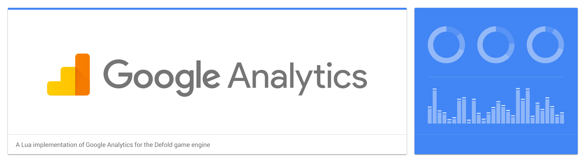
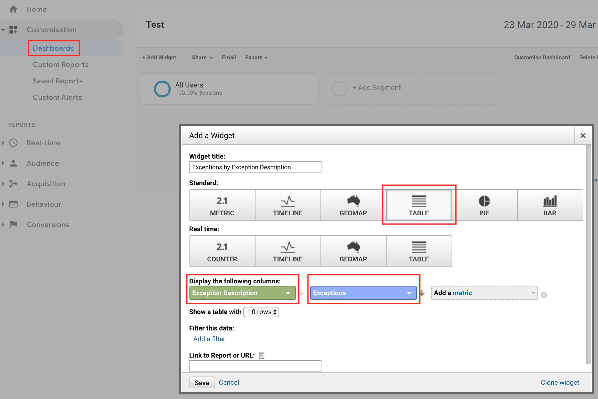

# Google Analytics for Defold
This is a Lua implementation of [Google Analytics](https://www.google.com/analytics) for the [Defold game engine](http://www.defold.com). The project is provided as a Defold library project for easy integration into Defold games. The implementation is loosely based on the design of the Google Analytics Android SDK, but with several simplifications thanks to the dynamic and flexible nature of Lua.

This Lua implementation uses the [Google Analytics Measurement Protocol](https://developers.google.com/analytics/devguides/collection/protocol/v1/) to make direct calls to the Google Analytics servers. On top of these raw calls the implementation also adds support for offline tracking, automatic crash/exception reporting and automatic retrieval of relevant tracking parameters such as app name, app id, language, screen resolution and so on.

## Installation
You can use Google Analytics in your own project by adding this project as a [Defold library dependency](http://www.defold.com/manuals/libraries/). Open your game.project file and in the dependencies field under project add:

	https://github.com/britzl/defold-googleanalytics/archive/master.zip

Or point to the ZIP file of a [specific release](https://github.com/britzl/defold-googleanalytics/releases).

## Configuration
Before you can use Google Analytics in your project you need to add your analytics tracking ID to game.project (`*`). Open game.project as a text file and create a new section:

	[googleanalytics]
	tracking_id = UA-1234567-1

Additional optional values are:

	[googleanalytics]
	dispatch_period = 1800
	queue_save_period = 60
	verbose = 1

`dispatch_period` is the interval, in seconds, at which tracking data is sent to the server.

`queue_save_period` is the minimum interval, in seconds, at which tracking data is saved to disk.

`verbose` set to 1 will print some additional data about when and how many hits are sent to Google Analytics. Set to 0 or omit the value to not print anything.

`*` = Google has changed the way you set up analytics and now make a clear distinction between mobile apps and websites. Mobile apps should use [Firebase Analytics](https://www.github.com/defold/extension-firebase-analytics) and websites should use Google Analytics. This is actually not strictly necessary and it is possible to use Google Analytics for a mobile apps and games. To get a tracking id you need to create a web property.

## Data processing latency
Keep in mind that there is a data processing latency of one or two days which means that you will not be able to see the data you generate in your application straight away. You should be able to see data in the realtime view with only a very slight delay though. 

More information: https://support.google.com/analytics/answer/1070983?hl=en

## Usage
Once you have added your tracking ID to game.project you're all set to start sending tracking data:

	local ga = require "googleanalytics.ga"

	function init(self)
		ga.get_default_tracker().screenview("my_cool_screen")
	end

	function update(self, dt)
		ga.update()
	end

	function on_input(self, action_id, action)
		if gui.pick_node(node1, action.x, action.y) and action.pressed then
			ga.get_default_tracker().event("category", "action")
		end

		if gui.pick_node(node2, action.x, action.y) and action.pressed then
			local time = socket.gettime()
			http.request("http://d.defold.com/stable/info.json", "GET", function(self, id, response)
				local millis = math.floor((socket.gettime() - time) * 1000)
				ga.get_default_tracker().timing("http", "get", millis)
			end)
		end
	end

Note that all tracking arguments of type string will be automatically URL encoded by the library.

## Supported hit types
This implementation supports the following hit types:

* Event - `ga.get_default_tracker().event(category, action, label, value)`
* Screen View - `ga.get_default_tracker().screenview(screen_name)`
* Timing - `ga.get_default_tracker().timing(category, variable, time, label)`
* Exception - `ga.get_default_tracker().exception(description, is_fatal)`, also see section on automatic crash/exception tracking

You can also register a raw hit where you specify all parameters yourself:

	ga.get_default_tracker().raw("v=1&tid=UA-123456-1&cid=5555&t=pageview&dp=%2Fpage")

A set of base parameters such as screen dimensions, uuid, application name etc are provided in `base_params` on the tracker instance. These can be useful when creating the params for a raw hit:

	print(ga.get_default_tracker().base_params)

	v=1&ds=app&cid=b80e6164-fc1f-4d76-cdae-dfb7e9a9507c&tid=UA-87977671-1&vp=1280x720&ul=en&an=Google_Analytics&aid=Google_AnalyticsDarwin&av=0.9

## Automatic crash/exception tracking
You can let Google Analytics automatically send tracking data when your app crashes. The library can handle soft crashes (ie when your Lua code crashes) using [sys.set_error_handler](http://www.defold.com/ref/sys/#sys.set_error_handler:error_handler) and hard crashes (ie when the Defold engine crashes) using [crash API](http://www.defold.com/ref/crash/). Enable automatic crash tracking like this:

	local ga = require "googleanalytics.ga"

	function init(self)
		ga.get_default_tracker().enable_crash_reporting(true)
	end

In order to see crashes in Google Analytics you need to [create a new Dashboard with a Table Widget](https://support.google.com/analytics/answer/1068218?hl=en) showing the `Exception Description` column and the `Exception` metric:

## Third party tools and modules used
The library uses the following modules:

* [json.lua by rxi](https://github.com/rxi/json.lua) (MIT License)
* [uuid.lua by Tieske](https://github.com/Tieske/uuid) (Apache 2.0)
* [url_encode() from Lua String Recipes](http://lua-users.org/wiki/StringRecipes)

The example project uses:

* [Dirty Larry UI library](https://github.com/andsve/dirtylarry)
* [Spineboy animation from the Spine animation tool](https://github.com/EsotericSoftware/spine-superspineboy).
